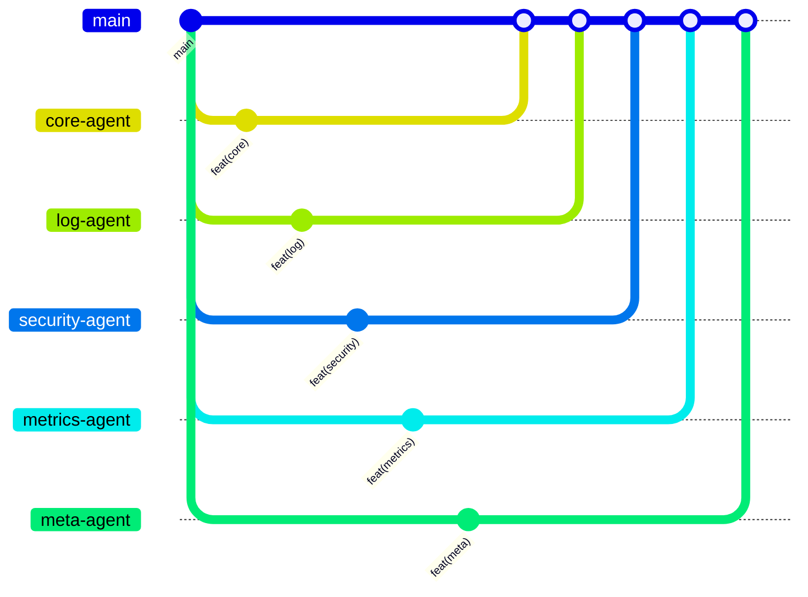

# Contributing to Athena AI

We love your input! We want to make contributing to Athena AI as easy and transparent as possible, whether it's:
- Reporting a bug
- Discussing the current state of the code
- Submitting a fix
- Proposing new features
- Becoming a maintainer

## Development Process

We use GitHub to host code, to track issues and feature requests, as well as accept pull requests.



## Development Workflow

1. Fork the repo and create your branch from `main`.
   ```bash
   git clone git@github.com:your-username/athena.git
   cd athena
   git checkout -b feature-name
   ```

2. Choose the appropriate agent branch:
   - `core-agent` for core functionality
   - `log-agent` for log analysis features
   - `meta-agent` for orchestration features
   - `metrics-agent` for metrics features
   - `security-agent` for security features

3. Make your changes and test them:
   ```bash
   # Install development dependencies
   pip install -r requirements-dev.txt
   
   # Run tests
   pytest
   
   # Run linting
   flake8
   ```

4. If you've added code, add tests.

5. Commit your changes:
   ```bash
   git commit -m "feat(agent-name): Description of changes"
   ```

   Follow the conventional commit format:
   - `feat(agent-name):` for new features
   - `fix(agent-name):` for bug fixes
   - `chore(agent-name):` for maintenance
   - `docs(agent-name):` for documentation
   - `test(agent-name):` for tests

6. Push to your fork and submit a pull request.

## Code Style

- Follow PEP 8 guidelines
- Use type hints
- Write docstrings in Google format
- Keep functions focused and small
- Add comments for complex logic

## Testing

- Write unit tests for all new features
- Maintain test coverage above 80%
- Include integration tests where necessary
- Test edge cases

## Pull Request Process

1. Update the README.md with details of changes to the interface
2. Update the requirements.txt if you've added dependencies
3. Update the documentation if you've changed APIs
4. The PR title should follow conventional commit format
5. Link any related issues in the PR description
6. Request review from at least one maintainer

## Community

- Discord: [Join our community](https://discord.gg/athena-ai)
- Issues: [GitHub Issues](https://github.com/m-kis/athena/issues)
- Wiki: [Project Wiki](https://github.com/m-kis/athena/wiki)

## License

By contributing, you agree that your contributions will be licensed under its MIT License.
