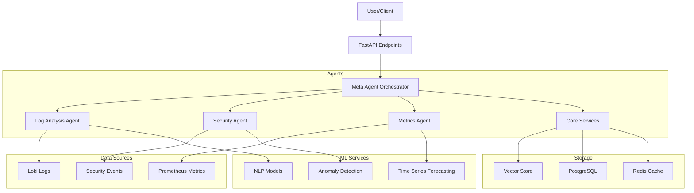

# Athena AI - Intelligent Log Analysis System

# Athena AI - Intelligent Log Analysis System

Athena AI is an advanced log analysis and monitoring system that uses multiple specialized agents to provide comprehensive system insights.

## Architecture


## Features

- 🤖 Multi-Agent Architecture
- 📊 Real-time Metrics Analysis
- 🔍 Advanced Log Analysis
- 🛡️ Security Monitoring
- 📈 Performance Tracking
- 🧠 Machine Learning Integration

## Quick Start

1. Clone the repository:
```bash
git clone https://github.com/m-kis/athena.git
cd athena
```

2. Set up environment:
```bash
python -m venv venv
source venv/bin/activate  # or `venv\Scripts\activate` on Windows
pip install -r requirements.txt
```

3. Configure environment:
```bash
cp .env.example .env
# Edit .env with your settings
```

4. Start services:
```bash
docker-compose up -d
```

5. Run the application:
```bash
uvicorn main:app --reload
```

## Project Structure

```
athena/
├── agents/
│   ├── core/         # Core functionality and shared components
│   ├── log/          # Log analysis agent
│   ├── meta/         # Meta agent orchestrator
│   ├── metrics/      # Metrics and monitoring agent
│   └── security/     # Security analysis agent
```

Each agent directory contains:
- `src/`: Source code
- `tests/`: Unit and integration tests
- `examples/`: Usage examples
- `README.md`: Agent-specific documentation

## Development

Each agent has its own branch for development:
- `core-agent`
- `log-agent`
- `meta-agent`
- `metrics-agent`
- `security-agent`

See [CONTRIBUTING.md](CONTRIBUTING.md) for development guidelines.

## Dependencies

Core Technologies:
- FastAPI
- LangChain
- ChromaDB
- PostgreSQL
- Redis
- Ollama (llama 3.2)

See `requirements.txt` for full list.

## Documentation

- [API Documentation](docs/api.md)
- [Agent Documentation](docs/agents.md)
- [Deployment Guide](docs/deployment.md)
- [Contributing Guide](CONTRIBUTING.md)

## License

This project is licensed under the MIT License - see the [LICENSE](LICENSE) file for details.

## Support

- Create an issue for bug reports or feature requests
- Join our [Discord community](https://discord.gg/athena-ai)
- Check out our [Wiki](https://github.com/m-kis/athena/wiki)
