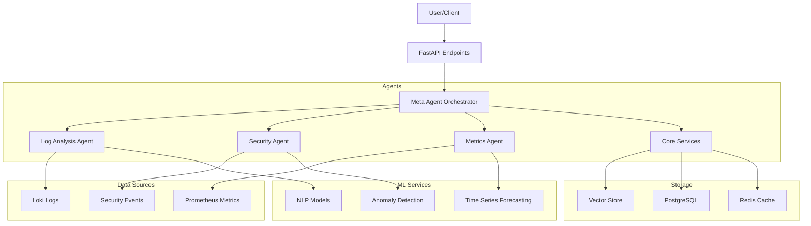

# Athena AI - Intelligent Log Analysis System


## Project Structure

- `agents/core`: Core functionality and shared components
- `agents/log`: Log analysis agent
- `agents/meta`: Meta agent for orchestration
- `agents/metrics`: Metrics and monitoring agent
- `agents/security`: Security analysis agent

## Installation

```bash
pip install -r requirements.txt
```

## Usage

[Documentation à venir]

## Contributing

Please read [CONTRIBUTING.md](CONTRIBUTING.md) for details on our code of conduct and the process for submitting pull requests.

## License

This project is licensed under the MIT License - see the [LICENSE](LICENSE) file for details
